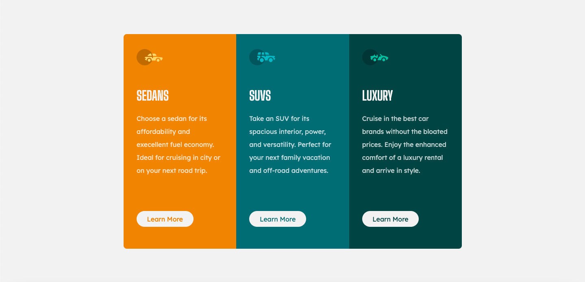

# Frontend Mentor Challenge - 3-column preview card component

## Welcome! 👋

Thanks for checking out my solution to this front-end coding challenge.

**To do this challenge, you need a basic understanding of HTML and CSS.**

## The challenge

The challenge is to build out this 3-column preview card component and get it looking as close to the design as possible.

Users should be able to:

- View the optimal layout depending on their device's screen size
- See hover states for interactive elements

## Where to find everything

The task is to build out the project to the designs given to me

The designs are in JPG static format. Using JPGs mean that I'll need to use my best judgment for styles such as `font-size`, `padding` and `margin`.

## Building The project

I used any workflow that I feel comfortable with. Below is a suggested process, but do not feel like you need to follow these steps:

Initialize my project as a public repository on [GitHub]. Creating a repo will make it easier to share codes with the community if help is needed.

## Got feedbacks ?

I love receiving feedbacks! I am always looking to improve. So if you have anything you'd like to mention, please email hi[at]adebayoeniola98[at]gmail[dot]com.

This challenge is completely free. Please share it with anyone who will find it useful for practice.

**YOURS FAITHFULLY!** 
**TECHBROJUICE**🚀
